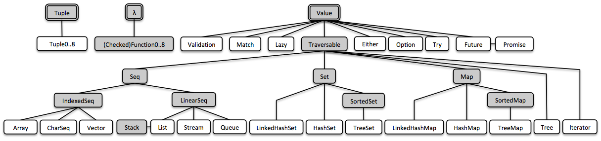

# vavr
### References
- [Vavr user guide](https://docs.vavr.io/)
- [Guide to Collections API in Vavr. Functional data structures](https://www.baeldung.com/vavr-collections)
### Overview of vavr
- 
### Note
- [official docs](https://docs.vavr.io/)
- `sorted sets is` backed by `binary tree structures`. `a sorted map` is `a sorted set containing key-value pairs and having an ordering for the keys`.
- `HashMap` is backed by [`hash Array Mapped Trie(HAMT)`](http://lampwww.epfl.ch/papers/idealhashtrees.pdf) and HashSet is backed by `a HAMT containing key-key pairs`.

#### Queue
- A Queue internally consists of `two linked lists`, `a front List`, and `a rear List`. 
  - The front List contains the elements that are dequeued
  - the rear List contains the elements that are enqueued.
  - (This allows enqueue and dequeue operations to perform in O(1). When the front List runs out of elements, front and rear List's are swapped, and the rear List is reversed.)
#### Stream
- A Stream is an implementation of `a lazy linked list` and `is quite different from java.util.stream.` Unlike java.util.stream, `the Vavr Stream stores data and is lazily evaluating next elements`.
- Vavr Stream is immutable and `may be Empty or Cons`. 
  - A `Cons` consists of `a head element` and `a lazy computed tail Stream`. 
  - Unlike a List, for a Stream, `only the head element is kept in memory`. The tail elements are computed on demand.
  - As opposed to Java 8 Stream API, Vavr's Stream is `a data structure` for storing a sequence of elements. Thus, it has methods like get(), append(), insert() and others for manipulating its elements.
- `Stream.empty`: represents the empty Stream.
- `Stream.Cons`: represents a Stream containing one or more elements.
- all of these equal. 
  - `Stream.empty()`, `Stream.of()`, `List.Nil.instance()`
  - `Stream.of(x)`, `new Cons<>(x, List.Nil.instance())`
- other examples:   
- `Stream.of(Object...)`, e.g.`Stream.of(1,2,3)`
- `Stream.ofAll(Iterable)`, e.g. `Stream.ofAll(List.of(1,2,3))`
- ? Stream.ofAll(<primitive array>), e.g. List.ofAll(1,2,3)

#### Values
- If you’re coming to Vavr after using Java’s `Optional` class, there is a crucial difference. 
  - In Optional, a call to `.map` that results in a `null` will result in `an empty Optional`. 
  - In Vavr, it would result in a `Some(null)` that can then lead to a `NullPointerException`.
  
